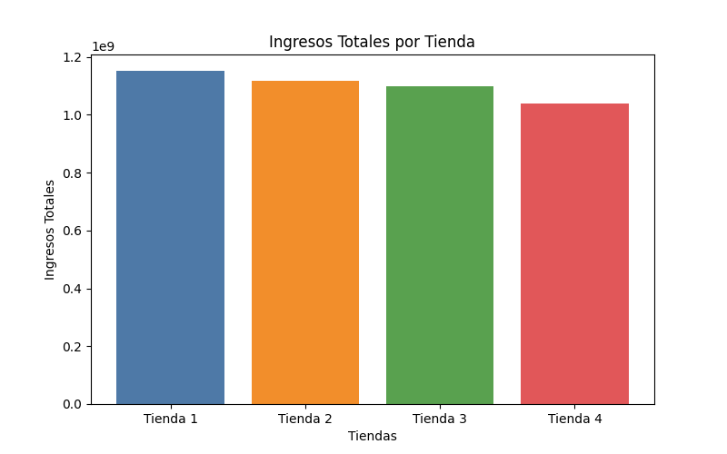
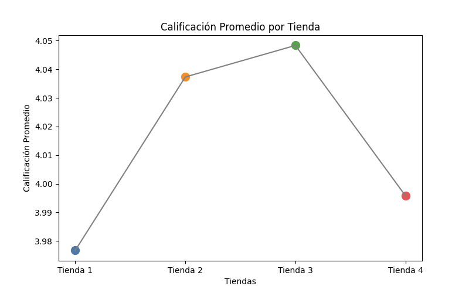

# Challenge
Analisis de ventas y rendimiento de tiendas 
Proyecto de análisis de datos en Python para evaluar el rendimiento de cuatro tiendas, considerando ingresos, categorías, satisfacción del cliente y desempeño geográfico.

Herramientas:
- Python
- Pandas
- Matplotlib

# Ingresos Totales por Tienda

Se calculó la facturación total de cada tienda sumando el precio de todos los productos vendidos.

Este análisis permite identificar qué tienda genera mayores ingresos y cuál tiene menor volumen de ventas.

---

# Ventas por Categoría de Producto

En este análisis se agruparon las ventas por **categoría de producto** para identificar cuáles son las más populares en cada tienda.

Esto permite entender qué tipo de productos tienen mayor demanda y cuáles tienen menor rotación.

---

# Calificación Promedio de los Clientes

Se calculó la **calificación promedio de los clientes para cada tienda**, lo que permite evaluar el nivel de satisfacción de los compradores.

Una mayor calificación promedio indica una mejor experiencia de compra.

---
# Conclusión

Después de analizar los ingresos, las categorías de productos, las calificaciones de los clientes, los productos más vendidos y los costos de envío, se puede comparar el desempeño general de cada tienda.

Este análisis permite identificar fortalezas y debilidades en cada una de ellas. La tienda con mejores resultados en ingresos, buena valoración de clientes y costos logísticos razonables representa la mejor opción para continuar con la operación.

Con base en estos factores, se puede recomendar la tienda que presenta el **mejor equilibrio entre ventas, satisfacción del cliente y eficiencia operativa**, permitiendo al Sr. Juan tomar una decisión informada sobre cuál tienda vender.

